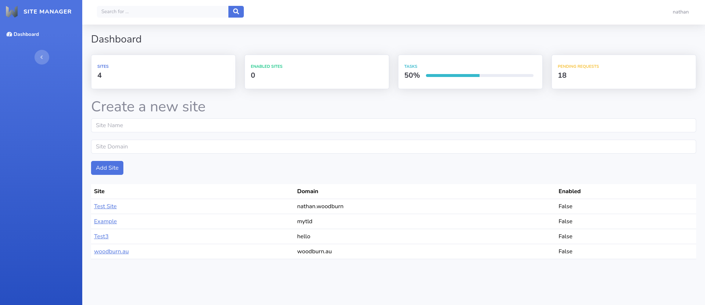
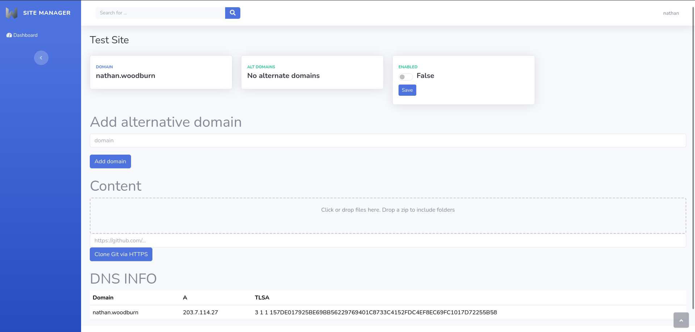
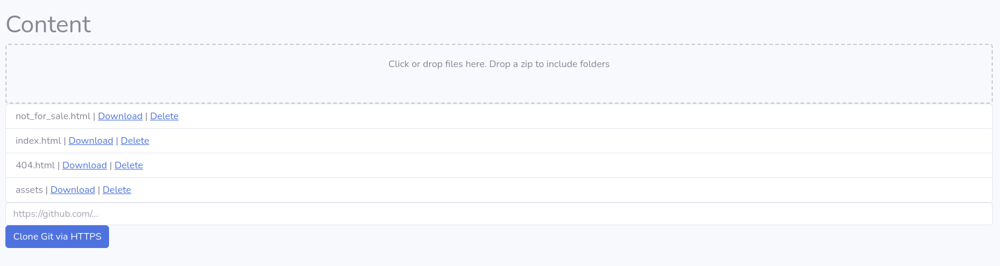
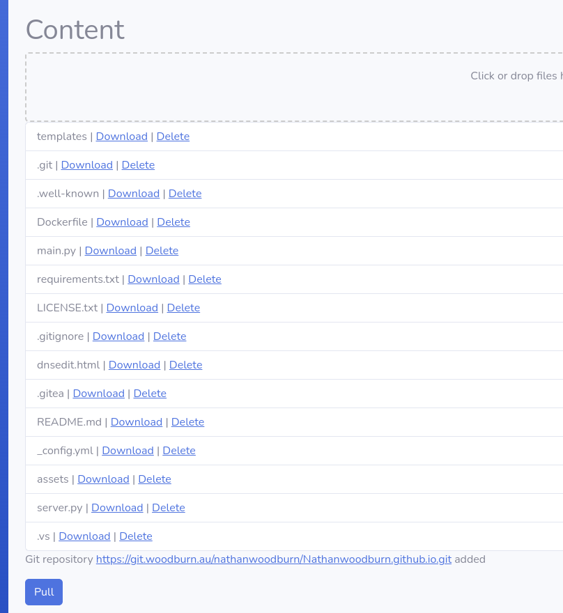

# site-manager

Installation
------------

```bash
wget https://git.woodburn.au/nathanwoodburn/site-manager/raw/branch/main/install.sh
chmod +x install.sh
sudo ./install.sh
```

Create account
--------------
Accounts can only be created by the root user
```bash
sudo -i
cd /root/site-manager
python3 account.py
exit
```


Updating
--------
```bash
sudo -i
cd /root/site-manager
git pull
exit
```


## Screenshots



